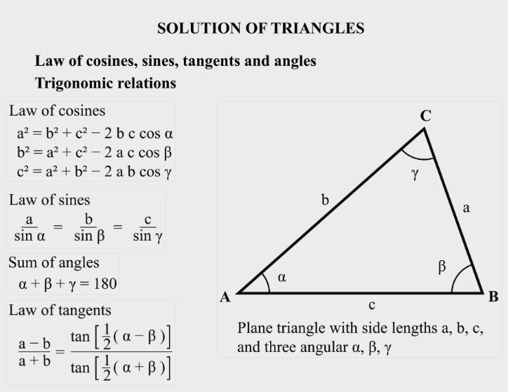

# Inverse Kinematics
역운동학은 인간이 로봇이나 캐릭터를 조종하기 편하게 만들기 위해서인데 복잡한 로봇 팔을 움직일 때마다 우리가 각 관절의 각도를 일일이 수치로 입력해야한다면 어떻게 할까?

역운동학은 이러한 번거로움을 해결하고 정밀한 작업을 가능하게 한다. 

### 주요 등장 배경
1. 직관적인 제어(Intuitive Control)
    사랑믕 무언가를 집을 때 어깨를 몇 도, 팔꿈치를 몇 도 움직여야지 라고 생각하지 않는다. 대신 저 물건을 잡아야지 라고 생각한다. 

2. 정밀한 작업 수행(Precise Task)
    산업용 로봇이 회로 기판에 부품을 꽂거나 용접을 할 때 아주 작은 오차도 허용되지 않는 경우가 많다. 
    
    단순 각도 조절(순운동학)로는 로봇 끝단을 정확한 3D 좌표에 위치시키기 매우 어렵기 때문에, 좌표값을 기준으로 관절을 역산하는 방식이 필수적이다.

3. 지형 적응 및 사옿작용(Environment Adaptation)
    게임이나 시뮬레이션에서 캐릭터가 계단을 오르거나 벽을 짚을 때 발이 손이나 허공에 떠 있거나 바닥을 뚫고 들어가면 몰입감이 깨진다. 

    이 때 캐릭터의 손발을 지형에 고정시켜야 하는데 이 때 골반부터 발끝까지의 관절 각도를 실시간으로 환경에 맞춰 보정하기 위해 역운동학이 도입됐다.

4. 자유도(Degree of Freedom)의 복잡성 해결
    인간의 몸이나 다관절 로봇은 수많은 관절을 가지고 있다. 관절이 7개 ~ 10개로 늘어나면 사람이 수동으로 제어하는 것이 불가능에 가까우며 역운동학을 통해 해결할 수 있다.


## 수학적 해결 방법 (알고리즘의 종류)

### 1. 분석적 방법 (Analytical Methods)
삼각 함수를 이용한다. 팔의 길이를 알고 목표 지점의 좌표를 알 때 제2코사인 법칙 같은 공식을 써서 각도를 직접 계산해낸다. 

계산이 매우 빠르고 정확한 정답을 하나 줄 수 있고 CPU 부하가 거의 없어 실시간 처리에 유리하지만 관절이 늘어나거나 3D 공간으로 확장되면 공식이 기하급수적으로 복잡해져서 공식을 유도하기 힘들다.

- 2D 평면에서의 2관절 팔: 팔의 길이 $l_1, l_2$와 목표 좌표 $(x, y)$가 주어졌을 때, 코사인 법칙을 이용해 각도 $\theta$를 구한다.

$$\cos(\theta_2) = \frac{x^2 + y^2 - l_1^2 - l_2^2}{2l_1l_2}$$

$l_1$ : 첫 번째 뼈 길이<br>
$l_2$ : 두 번째 뼈 길이<br>
$x, y$ : 목표 위치(target)의 좌표<br>
$\theta_2$ : 두 번째 뼈의 각도 <br>



### <span style="color:skyblue">발을 $(x,y)$ 위치에 놓으려고 할 때</span>
관절이 두 개가 있을 때 두 길이는 고정이다. <br>
- hip -> knee = $l_1$<br>
- knee -> foot(target) = $l_2$

이 때 삼각형 하나가 만들어진다. 

```
      knee
     /   \
   l1     l2
   /       \
 hip ------ target
        r
```

- hip -> target 의 거리: $r2=x2+y2$

- $r^2 = l_1^2 + l_2^2 - 2l_1l_2\cos(\theta_2)$

- $\cos(\theta_2) = \frac{r^2 - l_1^2 - l_2^2}{2l_1l_2}$

- $\theta_2 = acos((x*x + y*y - l_1*l_1 - l_2*l_2) / (2*l_1*l_2))$

### 2. 수치적/반복적 방법 (Numerical/Iterative Methods)

- <span style="color:skyblue">**FABRIK 알고리즘(Forward And Backward Reaching Inverse Kinematics)**</span>: Forward reaching과 Backward reaching을 반복해서 관절 위치를 맞추는 IK 방법이다.


## 2. 제약 조건 (Constraints)과 자유도


## 3. 다중 해(Multiple Solutions) 처리