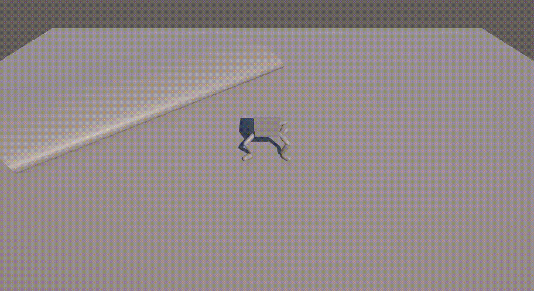

간단하게 4족 보행 PA를 작성했다.

1. 역운동학(Inverse Kinematics, IK) 
    - Target-Based Movement: 애니메이션 파일 없이 발의 목표지점(Foot_Target)만 옮기면 관절(Knee, Root)이 계산되어 자연스업게 꺾이는 기술이다.

2. 레이캐스팅 지형 적응(Raycast Terrain Adptation) 
    - 실시간 지면 탐색: 발밑으로 보이지 않는 ray를 쏴서 지면의 높이와 기울기를 실시간으로 파악한다. 
    - 동적 레이어 인식: Ground 레이어만 골라 인식하여 계단이나 언덕만 밟도록 설계했다.

3. 절차적 발걸음 로직(Gait Control) 
    - 상태 기반 보행: 발이 특정 거리(stepDistance)이상 멀어지면 다음 발걸음을 떼는 논리 구조
    - 팀 기반 교차 보행(Trot Gait): 4개의 다리를 대각선 쌍으로 묶어 LegManager가 제어한다.

4. 속도 기반 위치 예측(Velocity Prediction) 
    - 미래 위치 예측: 현재 몸통의 속도를 계산해 발을 이동 방향의 앞쪽에 미리 착지시킨다. 이를 통해 질질 끌려가는 느낌을 제거했다.

5. 동적 신체 제어(Dynamic Body Control) 
    - 플로팅 서스펜션(Floating): 중력을 직접 쓰지 않고 코드로 지면과의 높이를 유지하여, 어떤 지형에서도 몸체가 일정한 간격을 유지하게 했다.
    - 기울기 동기화(Surface Alignment): 지면의 법선(normal) 벡터를 몸체의 회전값에 투영하여 언덕 경사에 맞춰 몸이 기울어지게 했다.
    - 절차적 출렁임(Procedural Bobbing): Sin 파동을 이용해 이동 시 몸통이 위아래로 리듬감 있게 흔들리는 효과를 넣었다.